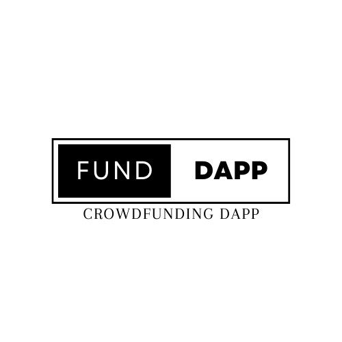

<!-- PROJECT SHIELDS -->
[![Stargazers][stars-shield]][stars-url]
[![Issues][issues-shield]][issues-url]
[![LinkedIn][linkedin-shield]][linkedin-url]

<!-- PROJECT LOGO -->
<br />
<p align="center">
  <a href="https://github.com/aindrajaya/dapp-crowdfunding-client">
    
  </a>

  <h3 align="center">Crowdfunding dApp</h3>

  <p align="center">
    Crowdfunding Decentralised Application
    <br />
    <a href="https://github.com/aindrajaya/dapp-crowdfunding-client"><strong>Explore the docs »</strong></a>
    <br />
    <br />
    <a href="https://github.com/aindrajaya/dapp-crowdfunding-client">View Demo</a>
    ·
    <a href="https://github.com/aindrajaya/dapp-crowdfunding-client/issues">Report Bug</a>
    ·
    <a href="https://github.com/aindrajaya/dapp-crowdfunding-client/issues">Request Feature</a>
  </p>
</p>

<!-- TABLE OF CONTENTS -->
<details open="open">
  <summary>Table of Contents</summary>
  <ol>
    <li>
      <a href="#about-the-project">About The Project</a>
      <ul>
        <li><a href="#built-with">Built With</a></li>
      </ul>
    </li>
    <li>
      <a href="#getting-started">Getting Started</a>
      <ul>
        <li><a href="#installation">Installation</a></li>
      </ul>
    </li>
    <li><a href="#roadmap">Roadmap</a></li>
    <li><a href="#contact">Contact</a></li>
    <li><a href="#license">License</a></li>
    <li><a href="#acknowledgements">Acknowledgements</a></li>
  </ol>
</details>

<!-- ABOUT THE PROJECT -->
## About the Crowdfunding dApp (Decentralised Application)
[![Product Name Screen Shot][product-screenshot]](https://dapp-crowdfunding-client.vercel.app/)

A decentralized crowdfunding app (also known as a web3 crowdfunding app) is a DApp that enables users to participate in crowdfunding campaigns using cryptocurrency or other digital assets. This can include campaigns to fund creative projects, startups, or other ventures.

One advantage of using a decentralized app for crowdfunding is that it allows for a more transparent and secure process, as the transactions are recorded on a public blockchain and cannot be easily altered or manipulated. This can help to build trust with potential donors and investors.

### Built With
This projects is built with
* [Thirdweb](https://thirdweb.com/) a powerful tools that simplify web3 development
* [React](https://reactjs.org/) is a JavaScript library for building user interfaces
* [Vite](https://vitejs.dev/) a javascript build tool


<!-- GETTING STARTED -->
## Getting Started
This is an example of how you may give instructions on setting up your project locally.
To get a local copy up and running follow these simple example steps.

### Installation
To run the application, after you install [Node.js](https://nodejs.org/) you also need [yarn](https://yarnpkg.com/) installed on your system. This project is also using [vite](https://vitejs.dev/) as a build tool that aims to provide a faster develpoment experience. Once you have those dependencies installed, you can install the application by running the following command in the root directory of the project:
```bash
$ cd your-project
$ yarn
$ yarn dev
``` 

### Usage
To use the application, you will need create build and deploy your smart contract (example) by using [Thirdweb](https://thirdweb.com/). Once you your smart contract address and put your contract in the `context/index.js` file, like this: 
```js
const {contract} = useContract('Your Smart Contract Address');
```
After that you can start the application by running the following command:
```bash
$ yarn dev
```
This will start the application and open a web browser window with the application interface. 


<!-- ROADMAP -->
## Roadmap

See the [open issues](https://github.com/aindrajaya/dapp-crowdfunding-client/issues) for a list of proposed features (and known issues).


<!-- CONTACT -->
## Contact
Arista - [@aindrajayaa](https://twitter.com/aindrajayaa) - arista.indrajay@gmail.com

Project Link: [Crowdfunding dApp](https://github.com/aindrajaya/dapp-crowdfunding-client)

<!-- LICENSE -->
## License
This application is licensed under the MIT License. See the [LICENSE](LICENSE) file for more details.

<!-- ACKNOWLEDGEMENTS -->
## Acknowledgements
* [React](https://reactjs.org/)
* [Thirdweb](https://thirdweb.com/)
* [Vite](https://vitejs.dev/)
* [GitHub Emoji Cheat Sheet](https://www.webpagefx.com/tools/emoji-cheat-sheet)
* [Img Shields](https://shields.io)
* [Choose an Open Source License](https://choosealicense.com)
* [GitHub Pages](https://pages.github.com)


<!-- MARKDOWN LINKS & IMAGES -->
<!-- https://www.markdownguide.org/basic-syntax/#reference-style-links -->
[stars-shield]: https://img.shields.io/github/stars/aindrajaya/dapp-crowdfunding-client.svg?style=for-the-badge
[stars-url]: https://github.com/aindrajaya/dapp-crowdfunding-client/stargazers
[issues-shield]: https://img.shields.io/github/issues/aindrajaya/dapp-crowdfunding-client.svg?style=for-the-badge
[issues-url]: https://github.com/aindrajaya/dapp-crowdfunding-client/issues
[linkedin-shield]: https://img.shields.io/badge/-LinkedIn-black.svg?style=for-the-badge&logo=linkedin&colorB=555
[linkedin-url]: https://www.linkedin.com/in/aindrajaya
[product-screenshot]: src/assets/screenshot.png
